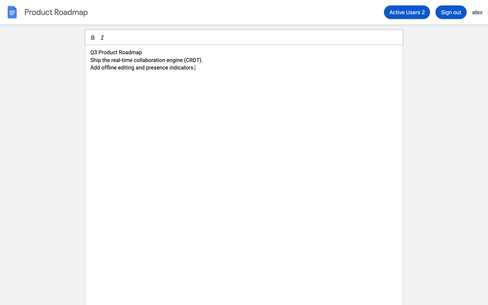
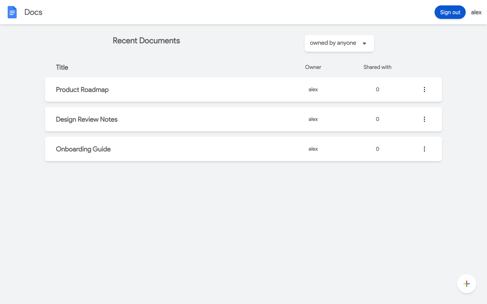
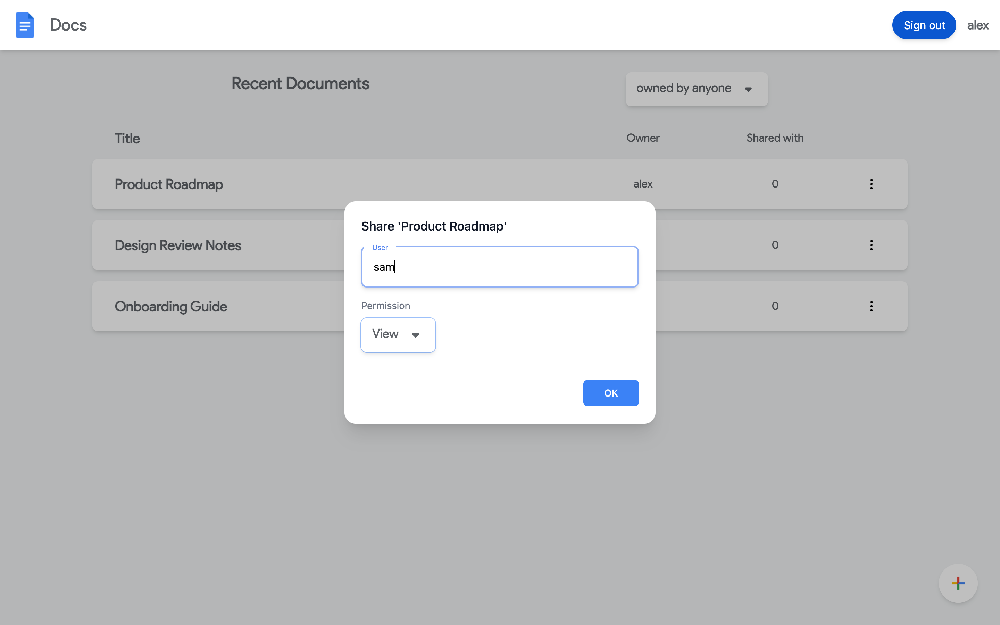
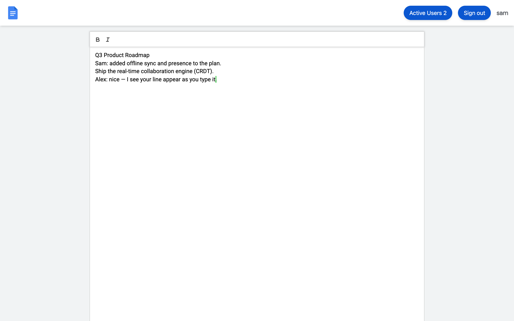
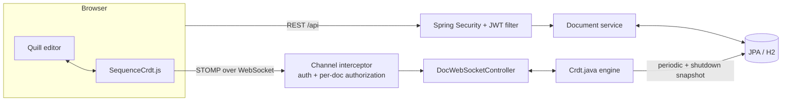

# Collaborative Text Editor

A real-time collaborative document editor — a minimal Google Docs — that I built to understand how
concurrent editing actually works under the hood. Several people can edit the same document at once,
and every keystroke merges without conflicts using a CRDT that I implemented from scratch and run on
**both** the browser and the server so they always converge to the same text.



## What it does

- **Accounts** — register and sign in (JWT authentication, BCrypt-hashed passwords)
- **Documents** — create, open, rename, delete, and list documents you own or that are shared with you
- **Sharing & permissions** — share a document as **viewer** or **editor**; only the owner can manage sharing
- **Real-time collaboration** — edit together live, with each collaborator's **cursor** and an **active-users** indicator
- **Rich text** — bold / italic formatting that merges just like text does
- **Durability** — in-progress edits survive a server restart, not just a graceful shutdown

| Documents | Sharing |
|---|---|
|  |  |

## How it works

### The real-time engine (the interesting part)

Instead of last-write-wins or a central lock, the editor represents a document as a **sequence CRDT**
(Conflict-free Replicated Data Type). Every character is a node with a globally unique id of the form
`counter@site` and links to its neighbours. Concurrent inserts that land in the same gap are ordered by
a **total order** over those ids (by site, then by numeric counter), so **every replica — the server and
each browser — independently arrives at the same document**, regardless of the order edits arrive in.

- **Insert** places a character between its origin-left and origin-right neighbours, then settles ties by the total order.
- **Delete** tombstones a character rather than removing it, so ids stay stable and late edits still merge.
- **The exact same integration rule** runs in the browser ([`frontend/src/crdt/sequenceCrdt.js`](frontend/src/crdt/sequenceCrdt.js))
  and on the server ([`backend/.../engine/Crdt.java`](backend/src/main/java/org/cce/backend/engine/Crdt.java)).

I care most about convergence being *correct*, so it's covered by tests on both sides — including a
randomized test that applies the same concurrent edits in hundreds of different orders and asserts every
run produces an identical document ([`CrdtTest.java`](backend/src/test/java/org/cce/backend/engine/CrdtTest.java),
[`sequenceCrdt.test.js`](frontend/src/crdt/sequenceCrdt.test.js)).



### Architecture



- A change in Quill becomes a CRDT operation, applied locally and published over STOMP.
- The server applies it to its own CRDT and broadcasts it; every other client integrates it and updates its editor.
- Document metadata, users, and permissions live in a relational schema (JPA/H2); the live CRDT is snapshotted back to the database periodically and on shutdown.

### Security

- **JWT** bearer auth; the signing secret is read from an environment variable and is never committed.
- **Per-document authorization** on *both* the REST endpoints and every WebSocket subscribe/send — you can only read documents you're on, and only edit ones you have edit rights to.
- **Owner-only** sharing and permission changes.
- Sensible defaults: stateless sessions, scoped CORS, the H2 console disabled outside a dev profile, and clickjacking protection left on.

## Tech stack

**Backend:** Java 17 · Spring Boot 3.2 · Spring Security · STOMP over WebSocket · Spring Data JPA · H2
**Frontend:** React 18 · Vite · Quill · react-stomp-hooks · Tailwind CSS

## Running it locally

**Backend**

```sh
cd backend
export JWT_SECRET_KEY=$(openssl rand -base64 48)   # required; the app refuses to start without it
./gradlew build                                    # compiles and runs the tests
./gradlew bootRun                                  # http://localhost:3000
```

**Frontend** (in a second terminal)

```sh
cd frontend
npm install
npm run dev                                        # http://localhost:5173
npm test                                           # runs the CRDT convergence tests
```

To point the frontend at a non-local backend, copy `frontend/.env.example` to `.env.local` and set
`VITE_API_URL` / `VITE_WS_URL`. Local development needs no `.env` file.

## Testing

- **Backend:** JUnit tests for the CRDT — convergence of concurrent operations, a 200-trial randomized
  delivery-order test, and serialization that preserves stable ids and tombstones.
- **Frontend:** Vitest tests for the mirrored CRDT module, plus lint on every file.

## Things I'd improve next

Being honest about the current limitations:

- **Causal delivery** — an operation that references a neighbour which hasn't arrived yet degrades to a
  best-effort placement instead of buffering until its dependency lands.
- **Tombstone GC** — deleted characters are retained forever; bounding this safely needs a version-vector scheme.
- **Auth hardening** — the JWT lives in `localStorage` (so it can ride the STOMP connect header); an
  `HttpOnly` cookie plus a token blocklist for real logout would be stronger.
- **Rich text** — only bold/italic today; headings, lists, and embeds would need the CRDT to carry block attributes.
